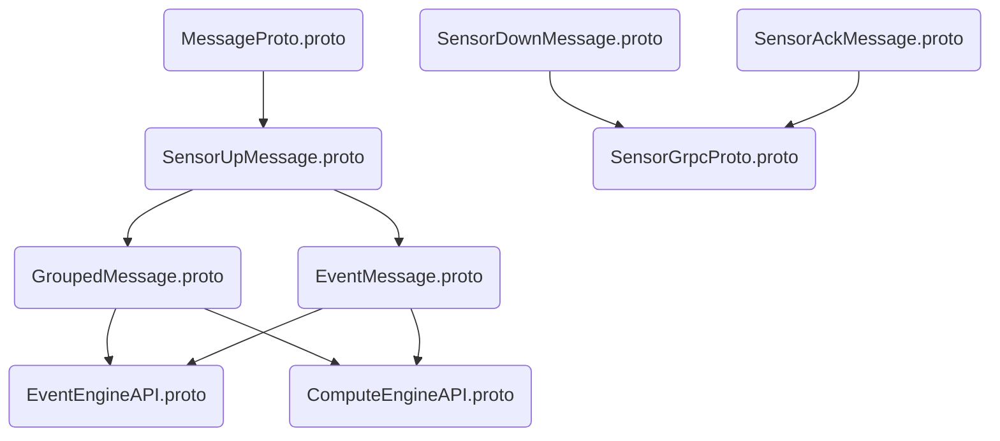
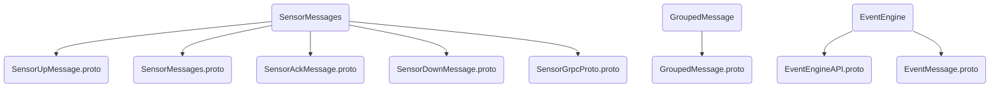
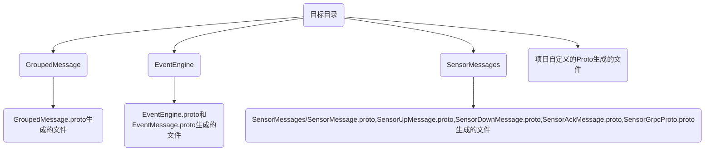

[[TOC]]

> 本目录下的文件为数据中台使用的传感类型定义文件

# proto结构图



# proto命名空间架构图



# 其他项目使用MessageProto指南

- 首先添加MessageProto为子模块
- 拷贝MessageProto/make/${对应开发语言}/gen_proto.sh到项目根目录
- 创建目标目录，然后修改脚本

## Cpp编译

```
安装gRPC插件：https://grpc.io/docs/quickstart/cpp/
```

```
//TOOD：添加C++版本的编译指令
```

## python编译

**参照gen_proto.sh示例编写编译脚本**

```
安装grpc插件：https://grpc.io/docs/quickstart/python/
```

## Go编译

**如果新增了自己的protobuf，请参照gen_proto.sh进行编写**

**如果没有创建自己的protobuf，直接运行gen_proto.sh，不需要的pb.go文件可在.gitignore酌情忽略，切记不要修改gen_proto.sh脚本**
**同一个包package的proto文件编译，必须使用同一条指令，不能拆开分别编译，不然会导致相关的签名问题**

```
安装grpc插件：https://grpc.io/docs/quickstart/go/
```

```
./gen_proto.sh ${目标路径} ${项目所属模块}
e.g.
./gen_proto.sh protofiles smartbow.net/dp/gogateway2project
```

生成的目录结构如下（相对于目标路径）：




# 名词解释

- 传感类型: 同类物理量的设备称之为传感类型，比如：温湿度传感类型应该包括温度计，湿度计，温湿度计传感器的数据包
- 状态类型: 同类含义的状态数据包，比如：TopInfoSensorNode,TopInfoTransNode，且两个数据包携带的信息基本相同，可以称之为TopInfo状态类型

# 引言

1. 数据中台按数据的作用，分为三种类型：
    - 上行消息SensorUpMessage
    - 下行消息SensorDownMessage
    - 下行消息对应的ack回复消息SensorAckMessage。
2. 数据中台对数据表达方式的抽象为网关+设备，及所有数据的交换，必须包含gateway_id和node_id的概念。
3. 数据中台对上行数据的接入单位为：gateway_id+node_id+channel+single data point,时间信息的表达为unixtime+microsecond
    - single data point的解释：对于连续数据（即有采样率的信息，e.g. 100Hz）需要将数据包中的数据点逐点输出，时间信息需要同时包含unixtime和microsecond
    - channel的解释：需要将多通道数据分通道输出。

# 定义原则

## 天条

- **文件编码格式必须为不带BOM的utf-8**
- **protobuf message name全局唯一，不能重名**
- **所有的up_message_proto.json和down_message_proto.json中的packets全局唯一，不能重名**
- **同一个物理量的含义命名必须一样，比如温度的表示必须全局统一成temp，速查表可到wsn-data master分支查看**
- **extension对象的定义中，key为物理量，value为物理量的数据类型，数据类型定义参照protobuf，只支持基本类型定义，不支持enum和message嵌套等定义**

## 下行消息定义

> 下行消息的配置文件中只包含需要配置参数的数据包，不需要参数的数据包，不要在配置文件中描述。完整数据包的支持，请参照相关产品的数据包文档。

1. 自研产品的下行指令（解析树有指令的描述）：fields和packets必须添加，且在解析树中有出处。extension可选，取决于数据中台后续数据使用是否需要约定字段及其类型。
    - 同一产品不同版本的下行数据包可归为一类，比如：GetVibraWireHFS200
    - 不同产品相同类型的下行数据包可归为一类，比如：定时任务指令，大部分字段可复用，将所有定时任务指令归为ConfigClockTask；又比如GetVibration，HCF300和HCF3000的采样指令参数和含义基本一致

2. 网关控制下行指令:和网关采用命令行进行交互，抽象的指令为GetGatewayCtrlInfo


3. 集成式产品(第三方)：消息定义配置可参照网关控制下行指令，fields字段为null，extension和packets必须添加。

## 上行消息定义

1. 自研产品的上行消息:fields和packets必须添加，且在解析树中有出处。extension可选，取决于数据中台后续数据使用是否需要约定字段及其类型。

    - 根据传感类型和状态类型进行数据包分类，相同硬件产品的不同版本，比如HCF2000 HCF2000V1都属于同一类传感类型；不同硬件产品但是输出量是一样的，也属于同一类传感类型，比如TopInfoSensorNode和TopInfoTransNode。

2. 集成式产品上行消息(第三方)，fields字段必须为null，packets和extension必须添加

## Ack消息定义

CmdAckConfig.json文件定义中定义了下行指令及其ack消息的映射关系。**所有的下行指令必须有对应的ack消息。**

# Proto3消息的使用

## 上行消息

上行消息的统一接口为：SensorUpMessage：
- string: packet_name为上行数据包的包名，填写集为up_message_proto.json中所有packets。
- string: node_id为节点id，自研产品为SN号后5位，第三方集成产品请和业务系统自行约定。
- string: gateway_id为网关sn号，第三方集成产品请与业务系统自行约定，注意SN号全局唯一性
- string: channel通道号
- uint32: unix_time:时间戳，单位为s
- int32: microsecond毫秒，单位为ms
- string: err_comment不需要关心
- string: sensor_id不需要关心
- oneof msg: 上行消息集，同一时刻只会有一个msg定义，具体的字段请根据定义进行赋值。

## 下行消息

下行消息的统一接口为: SensorDownMessage:

- string: instruction_name: 下行指令名，填写集为down_message_proto.json中所有的packets
- string: gateway_id表示需要通过该网关号节点设备的指令
- int32: node_id表示要配置的节点的id
- string: user_id和uint32: unix_time不需要客户端关心
- oneof msg:下行消息集，同一时刻只会有一个msg定义，需要填写参数的下行指令数据包请根据定义和下行指令手册进行填写，不需要填写参数的下行指令不需要关心该字段。

## ack消息

ack消息的统一接口为：SensorAckMessage，ack与下行指令的映射关系可到wsn-data中的cmd_json/CmdAckConfig.json查看:

- string: instruction_name: 下行指令的指令名
- string: packet_name: 回复数据包名
- string: gateway_id网关号
- int32: node_id节点号。
- uint32: unix_time时间戳
- ErrCode: err_code错误码
- string: comment:回复消息的具体描述信息，可不添写

# 附录 Protobuf

## Proto版本

**请使用Proto3**

**SensorMessages/目录下的内容不允许修改**


## Proto命名规范

### Message和Field命名

大写驼峰命名消息名，使用小写下划线分割字段命名

```
message SongServerRequest {
  required string song_name = 1;
}
```

编译转换出来的内容如下：

```
C++:
  const string& song_name() { ... }
  void set_song_name(const string& x) { ... }

Java:
  public String getSongName() { ... }
  public Builder setSongName(String v) { ... }
```

### Enums

使用大写驼峰命名

```
enum Foo {
  FIRST_VALUE = 0;
  SECOND_VALUE = 1;
}
```

每个枚举值应该使用分号结束

### Services

服务名和RPC方法名都使用大写驼峰命名

```
service FooService {
  rpc GetSomething(FooRequest) returns (FooResponse);
}
```

## Proto编写技巧

### 字段编号

Message定义中的每个字段都有一个unique number，这个编号用来在消息的二进制格式中辨识你的字段，并且一旦使用了就不能再更改这个字段编号。注意1-15的字段编号会使用1个字节进行编码，16-2047的编号需要两个字节。所以，你应该为频繁出现的message元素保留1-15。请记住为将来可能频繁出现的元素保留空间。

字段编号最小为1，最大为2^29-1。你不能使用19000-19999的编号（FieldDescriptor::kFirstReservedNumber through FieldDescriptor::kLastReservedNumber）因为它们为protocol buffer的实现保留。如果你是用了保留的编号，编译.proto的时候，会报错，类似的，你不能使用任何之前保留的编号。

# 附录 如何编译MessageProto

请参照项目根目录/CompileMessageProto下的readme文件
